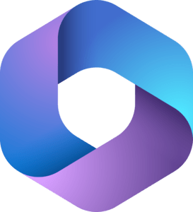

<h1>Cloud Services  </h1>
<h2> Azure AD now Entra ID </h2>
 

## Cloud Services

Hey,

Cloud services are becoming increasingly robust and are seen as the future for many small and medium-sized businesses. They offer cost-effectiveness and easy management, with built-in redundancy features that enhance reliability. Most providers offer trial subscriptions and provide credits for learning and experimentation, which I've utilized for my labs. If you haven't already, you should consider taking advantage of these opportunities.

I'll update with screenshots and processes over time. Currently, there are significant changes happening within Microsoft, and transitioning isn't straightforward, especially with the complexities of licensing. Working with trial versions adds an additional layer of challenge.

<b>Cloud Services</b>  
Hey, The Cloud services are getting better and robust by the day. It seems to be the future for most small andmedium size business. It is cost effective and the maanagement of these services are easy and business can benefit from the redundancy features they offer. most of these offer trial subscriptions and also give a credit to use and learn these features, which i have made use of for my labs. . If you have not you should too.i'll update the screenshots and process in time. Right now there is a lot of changes hppenning in Microsoft and the transition is a not all straight forward at least for me. there are issues around licensing, as there are a ton of them and i am working with trial versions its lot harder.   
   The Entra Admin Centre  

***Entra ID  (Azure Active Directory (Azure AD))*** 
As we all know the renaming of the Azure AD to Entra ID, Ill be using Entra and Entra ID.
Entra ID is Microsoft's cloud-based identity and access management service. It provides authentication and authorization services for users, devices, and applications, enabling centralized identity management across cloud and on-premises environments. Entra ID offers features such as single sign-on (SSO), multi-factor authentication (MFA), and role-based access control (RBAC). 
  

***Endpoint Manager Configuration Manager (MECM):*** 
Formerly known as System Center Configuration Manager (SCCM), Microsoft Endpoint Manager Configuration Manager (MECM) is a comprehensive solution for managing and deploying devices and applications in on-premises, cloud, and hybrid environments. MECM provides tools for configuring, monitoring, and securing devices, as well as deploying software updates and patches. 
  

***Microsoft 365 (M365) E3***  is a robust subscription plan designed for businesses and enterprises, offering a comprehensive suite of productivity and collaboration tools. It includes access to essential Office applications like Word, Excel, PowerPoint, and Outlook, providing users with powerful tools for document creation, data analysis, presentations, and email management. M365 E3 also offers advanced features such as enterprise-grade email hosting with Exchange Online, enabling businesses to communicate effectively and manage schedules with ease. Additionally, it includes cloud storage with OneDrive for Business, allowing users to securely store, access, and share files from anywhere. With built-in security and compliance features, M365 E3 helps businesses protect sensitive data, comply with regulations, and safeguard against cybersecurity threats. Its flexible licensing model and scalable solutions make it an ideal choice for businesses looking to enhance productivity, collaboration, and security across their organization. 

## Labs on Entra
- [PIM - Privileged Identity Management lab](https://github.com/rajeevlraman/Microsoft_Enterprise_mobility_and_security) 

  
<b>Microsoft Entra ID</b>  
  
<b>Microsoft Office 365</b>  
  
<b>Amazon Web Services - AWS</b>  
  

<!--

Here are some ideas to get you started:

- 🔭 I’m currently working on ...
- 🌱 I’m currently learning ...
- 👯 I’m looking to collaborate on ...
- 🤔 I’m looking for help with ...
- 💬 Ask me about ...
- 📫 How to reach me: ...
- 😄 Pronouns: ...
- ⚡ Fun fact: ...
-->
